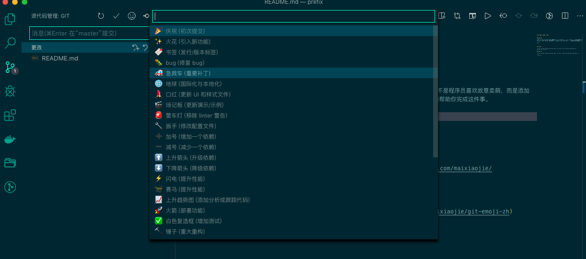

# Git Emoji Commit 中文版

## Features

程序员都爱 github，而许多程序员喜欢在 github 提交代码时加入 emoji 表情。 并不是程序员喜欢故意卖萌，而是添加了 emoji 表情的提交记录真的能包含很多有用信息，阅读体验非常棒。这个插件能完美的帮助你完成这件事。

## issues

[https://github.com/maixiaojie/git-emoji-zh/issues](https://github.com/maixiaojie/git-emoji-zh/issues)

## sources

[https://github.com/maixiaojie/git-emoji-zh](https://github.com/maixiaojie/git-emoji-zh)

**Enjoy!**
